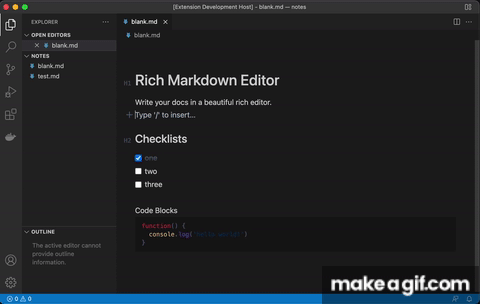

# inkwell.md

Edit markdown files with a rich editor in the style of Dropbox Paper/Notion etc.

Perfect for writing docs, authoring blog posts, and editing markdown website content.

## Features

- Preview and edit in a single view
- Format with markdown syntax or slash commands
- Syntax highlighting for code blocks
- Easily add tables, checkboxes, dividers, quotes, links etc
- **AI-powered completion suggestions** using GitHub Copilot (when available)
- Smart completion that respects line endings and markdown context
- Tab to accept, Escape to dismiss AI suggestions

This extension replaces the default code editor for markdown files with a rich version, allowing you to "edit" in preview mode.

It uses the [rich-markdown-editor](https://github.com/outline/rich-markdown-editor) project generously open sourced by [Outline](https://www.getoutline.com/)

## Credits

This project is based on [Rich Markdown Editor VSC](https://github.com/patmood/rich-markdown-editor-vsc) by [@patmood](https://github.com/patmood). We're grateful for their excellent work in bringing rich markdown editing to VS Code.
