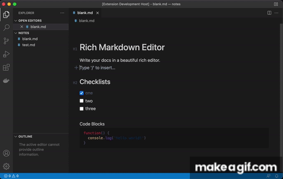

# Inkwell.md

Edit markdown files in VS Code with a rich, WYSIWYG editor in the style of
Dropbox Paper / Notion — preview and edit in a single view, with built-in
PlantUML and Mermaid diagrams.

 

Perfect for writing docs, authoring blog posts, editing markdown website
content, and maintaining git-hosted wikis (including Azure DevOps wikis).

It uses the [rich-markdown-editor](https://github.com/outline/rich-markdown-editor)
project generously open sourced by [Outline](https://www.getoutline.com/).

## Requirements

* **VS Code 1.125 or later.**
* Nothing else for plain markdown editing. The optional features below have
  their own prerequisites:

| Feature | Needs |
| --- | --- |
| PlantUML diagrams | A Java runtime (JRE/JDK **8 or later**) with `java` on your `PATH`. The PlantUML jar itself is bundled with the extension. |
| Better PlantUML layouts | [Graphviz](https://graphviz.org/download/) (`dot` on your `PATH`) — **optional**. Without it, PlantUML's built-in Smetana layout engine is used automatically, so diagrams always render. |
| Mermaid diagrams | Nothing — rendered inside the editor. |
| AI completions | [GitHub Copilot](https://marketplace.visualstudio.com/items?itemName=GitHub.copilot) signed in, with one of the free-tier models available (see [AI completions](#ai-completions)). |
| Azure DevOps work items / mentions | An Azure DevOps personal access token (see [Azure DevOps wikis](#azure-devops-wikis)). |

To install Java, use e.g. [Adoptium](https://adoptium.net/), then check it is
available in a terminal with `java -version`. Reload VS Code after installing
Java or Graphviz so the extension picks them up.

## Opening files

The editor is registered for `*.md` and `*.markdown` files. Opening a markdown
file from the Explorer (or any other way that opens it as a regular text tab)
automatically switches it to the rich editor.

* **Diff views are left alone** — Source Control diffs still use VS Code's
  line-by-line text diff.
* To edit the raw text in VS Code's own text editor instead, use
  **Reopen Editor With… → Text Editor** from the tab's context menu or the
  Command Palette.

The editor toolbar in the top-right corner has two buttons:

* **`< >` / 👁** — switch between the rich editor and a **source mode**
  (CodeMirror) showing the raw markdown exactly as it is saved to disk.
* **⇤⇥ / ⇥⇤** — toggle between a readable centered column and full width.

The document stays a normal VS Code text document: saving, undo, dirty state,
and external changes (git checkout, another editor, a script) all work as
usual and are reflected in the open editor.

## Features

### Writing and formatting

* **Markdown shortcuts while you type** — `#`–`######` headings, `-`/`*`/`1.`
  lists, `[ ]` todo items, `>` quotes, ```` ``` ```` code blocks, `---`
  dividers, `**bold**`, `*italic*`, `__underline__`, `~strike~`, `==highlight==`,
  `` `code` ``.
* **Slash commands** — type `/` on an empty line for a filterable menu to insert
  headings, todo/bulleted/ordered lists, tables, quotes, code blocks, dividers,
  page breaks, images, links, PlantUML and Mermaid diagrams, collapsible
  sections, and info/warning/tip notices.
* **Formatting toolbar** on text selection — bold, strikethrough, highlight,
  inline code, headings, quote, lists and links.
* **Emoji picker** — type `:` followed by a name (e.g. `:smile`).
* **Smart typography** — smart quotes, `...` → `…`, `->` → `→`.
* **Tables** — insert from the slash menu, then use the row/column toolbars to
  add, delete and align columns and rows. `Tab` / `Shift+Tab` move between
  cells (and `Tab` in the last cell adds a row). Line breaks inside cells are
  preserved.
* **Code blocks** with syntax highlighting and a language picker. Code pasted
  from a VS Code editor keeps its language.
* **Notices** — `:::info`, `:::warning` and `:::tip` callout blocks.
* **Collapsible sections** — `<details>` blocks (with their `open` attribute and
  `<summary>` label) are edited as real disclosure widgets instead of raw HTML.
* **Collapsible headings** — fold a heading's section with the arrow next to
  it; the `#` anchor next to a heading copies a link to it.
* **Frontmatter** (`---` YAML block at the top of the file) is preserved and
  shown as an editable block.
* **Find in document** — `Ctrl+F` / `Cmd+F` opens a search bar with match
  count, next/previous and a match-case toggle.
* **Faithful round-trips** — opening and saving a file doesn't reformat parts
  you didn't touch: table layouts, image syntax and notice fences are kept
  byte-for-byte where possible. See also
  [Preserving empty paragraphs](#preserving-empty-paragraphs).

### Links

* **Create or edit links** with `Ctrl+K` / `Cmd+K` — a two-field dialog for the
  link title and URL, pre-filled when the cursor is on an existing link.
* **Link to files in your workspace** — typing in the URL field searches the
  workspace's files (respecting `files.exclude`, and skipping `node_modules`,
  `.git`, `bin`, `obj`, `dist`, `out` and `build`) and inserts a path relative
  to the current document.
* **Follow a link** with `Ctrl+Click` / `Cmd+Click` or the link toolbar's
  *Open link* button. A plain click just places the cursor so link text can be
  edited like normal text.
  * Relative paths (`./other.md`, `../guide/intro.md`) open relative to the
    current document.
  * `/`-prefixed paths (`/docs/page.md`) are resolved against the root of the
    **git repository** containing the document (falling back to the VS Code
    workspace folder when the file isn't in a repository). This matches how
    GitHub and Azure DevOps wikis resolve them, even if you opened a parent
    folder of the repository in VS Code.
  * Web URLs open in your browser.

### Images and files

* **Paste or drop images** from outside VS Code (clipboard, file manager,
  browser): the image is saved to an `images` folder at the repository root
  (as `<name>-<timestamp>.<ext>`) and linked as `/images/…`.
* **Drag and drop files from VS Code** — drop a file from the Explorer into
  either editor mode and it is linked, not copied: images become
  ``, anything else a plain link. The path is always
  relative to the markdown file being edited.
* **Images** can be zoomed, panned and opened fullscreen, and have an editable
  caption (the alt text). The image toolbar aligns, downloads, replaces or
  deletes an image.
* **SVG files render inline**, so diagrams exported by tools like
  [Draw.io Integration](https://marketplace.visualstudio.com/items?itemName=hediet.vscode-drawio)
  keep their shape labels (an `` drops the `<foreignObject>` content those
  labels live in) and stay sharp at any zoom level.
* Images referenced from anywhere in the git repository render, even when it
  lies outside the opened workspace folder.

### Diagrams

* **PlantUML** — ```` ```plantuml ```` blocks with side-by-side source editing
  and a live diagram preview. Previews can be zoomed, panned and opened
  fullscreen. Rendering requires Java (see [Requirements](#requirements)).
  * **Theme-aware styling**: start a diagram with the comment line
    `' vscode-style` to render it with your VS Code theme's colors. New
    diagrams inserted from the slash menu include it.
  * Optionally keep diagram sources in a sidecar `.plantuml` file and link
    generated `.svg` files from the markdown — see
    [External PlantUML files](#external-plantuml-files) (on by default).
* **Mermaid** — ```` ```mermaid ```` blocks with the same side-by-side editing
  and live preview. Rendered in the webview, so no Java (or any other
  prerequisite) is required, and the diagram picks up the editor's theme colors
  automatically.

### AI completions

Inline suggestions powered by GitHub Copilot through VS Code's Language Model
API.

* Press `Ctrl+Space` (`Cmd+Space` on macOS) to request a suggestion at the
  cursor. It appears as ghost text; press `Tab` to accept it or `Escape` to
  dismiss it.
* The suggestion continues your text in context and respects markdown
  structure and line endings.
* To avoid consuming premium requests, **only free-tier Copilot models are
  used** (`gpt-4o-mini`, `gpt-5-mini` or `claude-haiku-4.5`, in that order of
  preference). If none of them is available, nothing is requested.

### Azure DevOps wikis

When an Azure DevOps personal access token is configured, the rich editor
renders the references Azure DevOps wikis store as plain text the way the wiki
itself does:

* **Work items** — `#123` is shown as a link with the work item's type, title
  and state. Links to a work item are shown the same way, whether pasted as a
  bare URL or written as a markdown link (`[text](url)` or `<url>`):
  `https://dev.azure.com/{org}/{project}/_workitems/edit/123` or
  `https://{org}.visualstudio.com/{project}/_workitems/edit/123`. Links into an
  organization other than the one being looked up in are left as they are.
* **User mentions** — `@<user-guid>` is shown as `@Display Name`.

The markdown on disk is not changed. To set it up:

1. Create a [personal access token](https://learn.microsoft.com/azure/devops/organizations/accounts/use-personal-access-tokens-to-authenticate)
   with the **Work Items (Read)** and **Identity (Read)** scopes.
2. Put it in `inkwell-md.azureDevOps.personalAccessToken` in your **user**
   settings (it can't be set in workspace settings, so it never ends up in a
   committed `settings.json`).
3. The organization is detected from the git remote of the repository
   containing the markdown file (`dev.azure.com` and `*.visualstudio.com`
   remotes, https or ssh). Set `inkwell-md.azureDevOps.organization` if the
   remote isn't an Azure DevOps one.
4. Reopen the editor.

## Keyboard shortcuts

`Mod` is `Ctrl` on Windows/Linux and `Cmd` on macOS.

| Shortcut | Action |
| --- | --- |
| `Mod+B` / `Mod+I` / `Mod+U` | Bold / italic / underline |
| `Mod+D` | Strikethrough |
| `Mod+Ctrl+H` | Highlight |
| `` Mod+` `` | Inline code (not on macOS) |
| `Mod+K` | Create / edit link |
| `Ctrl+Shift+1` … `Ctrl+Shift+6` | Heading level 1–6 |
| `Ctrl+Shift+0` | Paragraph |
| `Ctrl+Shift+7` / `8` / `9` | Todo / bulleted / ordered list |
| `Ctrl+Shift+\` | Code block |
| `Mod+]` | Quote (outside lists) / indent list item |
| `Mod+[`, `Shift+Tab` | Outdent list item |
| `Alt+↑` / `Alt+↓` | Move list item up / down |
| `Mod+_` | Divider |
| `Shift+Enter` | Line break |
| `Tab` / `Shift+Tab` | Next / previous table cell |
| `Mod+F` | Find in document |
| `Mod+Space` | Request an AI completion |
| `Mod+Z` / `Mod+Y`, `Mod+Shift+Z` | Undo / redo |
| `Mod+S` | Save |

## Settings

Configure the extension via VS Code settings (`Ctrl+,` / `Cmd+,`, then search
for "inkwell"). Unless noted otherwise, **reopen the editor** for a change to
take effect.

| Setting | Default | Description |
| --- | --- | --- |
| `inkwell-md.fontSize` | `16px` | Base font size used to render markdown. |
| `inkwell-md.fontFamily` | system UI font stack | Font family used to render markdown. |
| `inkwell-md.preserveEmptyParagraphs` | `false` | Preserve intentional empty paragraphs (blank lines) when saving by writing a `\` on each empty line. See [below](#preserving-empty-paragraphs). |
| `inkwell-md.plantumlExternalFiles` | `true` | Store PlantUML sources in a `<name>.plantuml` sidecar file and keep only a generated SVG image link in the markdown, instead of an inline fenced code block. See [below](#external-plantuml-files). |
| `inkwell-md.plantumlAttachmentsFolder` | `.attachments` | Folder (relative to the git repository root, or the workspace folder if the file isn't in a repo) where SVGs generated from external PlantUML files are written. Only used when `plantumlExternalFiles` is enabled. |
| `inkwell-md.azureDevOps.personalAccessToken` | *(empty)* | Azure DevOps personal access token (**Work Items (Read)** and **Identity (Read)** scopes). When set, work item references (`#123` and links to work items) and user mentions (`@<user-id>`) are rendered like the Azure DevOps wiki does. User settings only. See [Azure DevOps wikis](#azure-devops-wikis). |
| `inkwell-md.azureDevOps.organization` | *(empty)* | Azure DevOps organization to look up work items and users in, as a name (`contoso`) or URL (`https://dev.azure.com/contoso`). When empty, it's taken from the git remote of the repository containing the markdown file. Only used when a personal access token is set. Takes effect on the next lookup. |

### Preserving empty paragraphs

Standard markdown has no way to represent an empty paragraph: any number of
consecutive blank lines collapses into a single paragraph break when the file is
re-read. By default this extension follows that convention, so extra blank lines
you add in the editor are not kept on save.

If you want to keep intentional blank lines between content, enable
`inkwell-md.preserveEmptyParagraphs`. When enabled, each empty paragraph is saved
as a backslash (`\`) on its own line so it survives a reload, for example:

```markdown
Line A
\
\
Line B
```

Trailing blank lines at the end of the file are still trimmed. **Reopen the
editor after changing this setting** for it to take effect.

### External PlantUML files

With `inkwell-md.plantumlExternalFiles` enabled (the default), a PlantUML
diagram's source is stored in a sidecar `.plantuml` file next to the markdown
document, and a real `.svg` file is generated and linked from the markdown as a
normal image. This keeps the markdown clean and lets other renderers (GitHub,
VS Code's built-in preview, Azure DevOps wiki) show the diagram instead of a
raw code block. The in-editor experience doesn't change — diagrams are still
edited inline with a live preview; only where the source and rendered image
are stored on disk changes, and only on save.

Disable the setting to keep diagram sources inline in the markdown as
```` ```plantuml ```` fences instead.

For `docs/architecture.md` with two diagrams, saving produces:

```
docs/architecture.md          
                               
docs/architecture.plantuml     @startuml architecture-1 … @enduml
                                @startuml architecture-2 … @enduml
.attachments/docs/architecture/architecture-1.svg
.attachments/docs/architecture/architecture-2.svg
```

The source mode (`< >`) shows the markdown as saved, i.e. with the image links.

The sidecar is watched while the document is open, so editing
`docs/architecture.plantuml` outside the editor — in another tab, from a
script, or by handing the file to an AI agent — updates the inline source and
the rendered diagram immediately, and regenerates the affected `.svg` files.

Diagrams keep a stable name for life (`architecture-1`, `architecture-2`, …,
gaps allowed), so reordering or deleting a diagram doesn't rewrite unrelated
links or files. Only the SVGs generated from *this* document's sidecar are
ever touched: other images referenced by the markdown (pasted screenshots,
hand-written `` links) and other files that happen to live in the
attachments folder are always left alone, even if you point
`plantumlAttachmentsFolder` at a folder that already holds unrelated content.

Known limitations:

* Renaming or moving the `.md` file does not move its sidecar or attachments.
* Changing `plantumlAttachmentsFolder` on a repo that already has generated
  SVGs regenerates them under the new folder on the next save and rewrites
  the links, but does not clean up the old folder.
* With the setting turned **off**, a document that was previously
  externalized shows its diagrams as plain (non-editable) images — turning
  the setting back on restores inline editing. There's no automatic
  re-inlining while it's off.
* A diagram *added* to the sidecar externally is picked up, but nothing
  links to it until you add an image link for it to the markdown yourself.
  A diagram *removed* externally is kept as long as the markdown still links
  to its `.svg`, so the document never ends up pointing at an image nothing
  regenerates.
* If Java is unavailable, the sidecar file and image links are still written,
  but the SVGs are not generated.
* Sidecar files using `@startuml(name)` (parentheses, no space — a
  convention used by some external PlantUML tooling) are read correctly, but
  are always rewritten as `@startuml name` (space-separated) on the next
  save.

## Troubleshooting

* **PlantUML diagram shows an error about Java** — install a Java runtime,
  make sure `java -version` works in a terminal, and reload VS Code.
* **Diagram layout looks different from other PlantUML tools** — install
  Graphviz and reload VS Code; without it the Smetana layout engine is used.
* **No AI suggestion appears** — check that GitHub Copilot is installed and
  signed in and that one of the free-tier models listed above is available to
  your account.
* **Work item references aren't rendered** — check the token's scopes and, if
  the repository's remote isn't on Azure DevOps, set
  `inkwell-md.azureDevOps.organization`. Then reopen the editor.
* Diagnostic output is written to the **inkwell.md** channel in the Output
  panel.

## Credits

This project is based on [Rich Markdown Editor VSC](https://github.com/patmood/rich-markdown-editor-vsc) by [@patmood](https://github.com/patmood). We're grateful for their excellent work in bringing rich markdown editing to VS Code.
