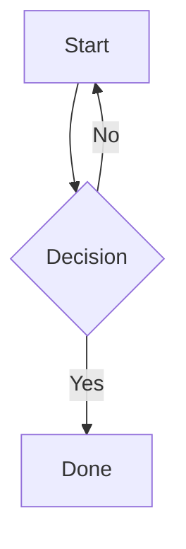
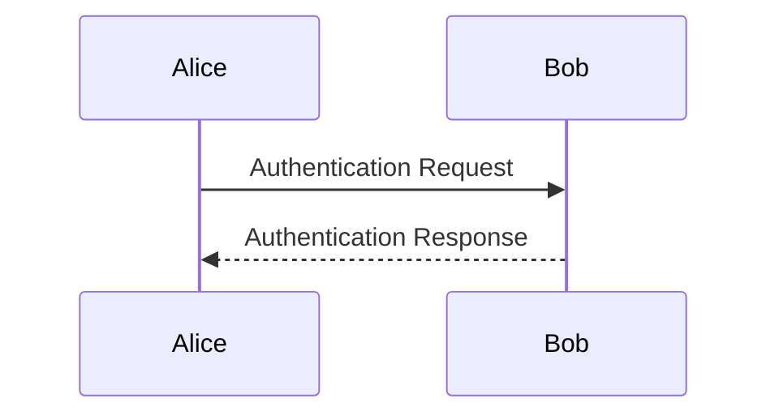
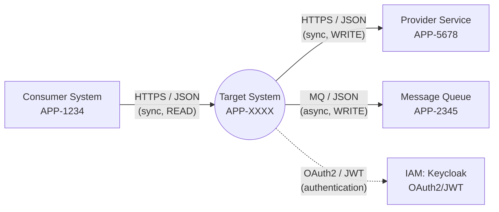

# Mermaid demo

A flowchart:



Some prose between two diagrams.

A sequence diagram:



An intentionally broken diagram (should show a parse error in the preview

pane, and the raw source in the collapsed view — never a "bomb" graphic):

```mermaid
flowchart TD
  A --> ??? -->
```

A regular fenced code block that must stay a code block, not a diagram:

```ts
const answer = 42;
```



